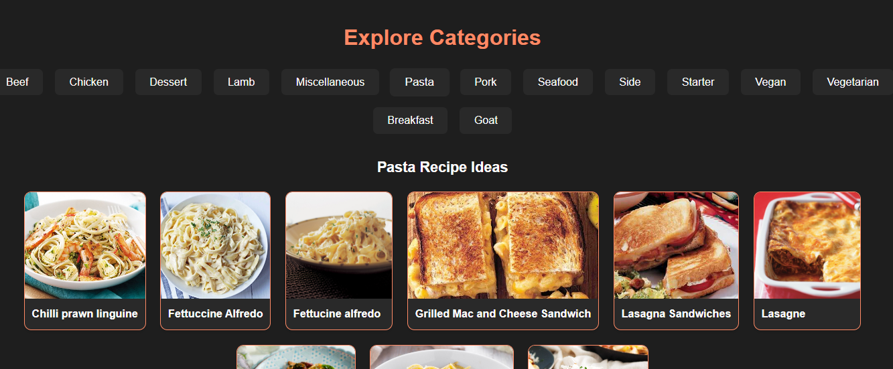
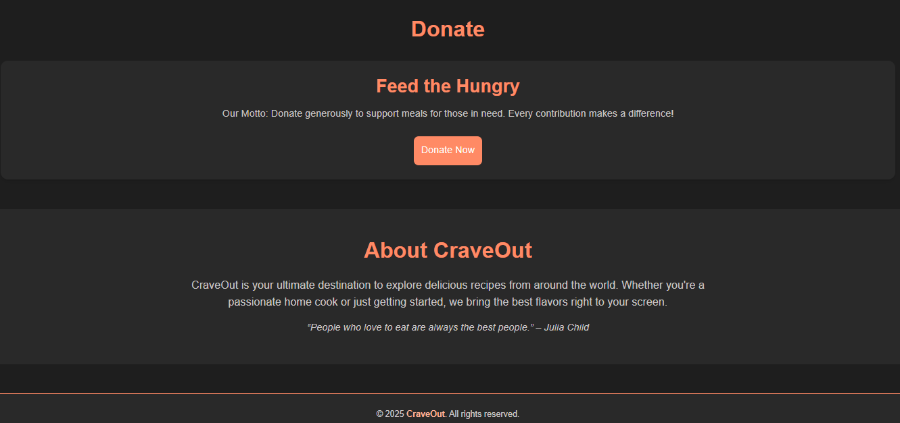

# CraveOut 🍽️ - React + TypeScript + Vite

**CraveOut** is a dynamic recipe explorer built using React, TypeScript, and Vite. It fetches delicious meals from the [TheMealDB API](https://www.themealdb.com/) and provides features like category browsing, trending meals, search functionality, theme toggling, and more – all with a responsive UI and modern design.

---

## 🔥 Features

* 🌐 Hero Section with Dynamic Search
* 📈 Trending Recipes (Random Meals)
* 📂 Category-based Recipe Browsing
* 💡 Light/Dark Theme Toggle
* 📦 Responsive Design with TailwindCSS
* 🍝 RecipeCard with Quick View Overlay

---
## 🚀 Getting Started

### 1. Clone the repo

```bash
git clone https://github.com/your-username/craveout-react.git
cd craveout-react
```

### 2. Install dependencies

```bash
npm install
```

### 3. Run the dev server

```bash
npm run dev
```

### 4. Build for production

```bash
npm run build
```

### 5. Preview production build

```bash
npm run preview
```

---

## 💻 Tech Stack

* React + TypeScript
* Vite
* TailwindCSS
* TheMealDB API

---

## 📁 Folder Structure

```
├── public/images
├── src/
│   ├── components/
│   │   ├── About.tsx
│   │   ├── Categories.tsx
│   │   ├── CategoryCard.tsx
│   │   ├── Donate.tsx
│   │   ├── Footer.tsx
│   │   ├── Hero.tsx
│   │   ├── Instructions.tsx
│   │   ├── Navbar.tsx
│   │   ├── RecipeCard.tsx
│   │   └── TrendingRecipes.tsx
│   ├── App.tsx
│   ├── main.tsx
│   ├── index.css
│   └── vite-env.d.ts
├── .gitignore
├── eslint.config.js
├── index.html
├── package.json
├── README.md
├── tsconfig.json
└── vite.config.ts
```

---

## 🧱 Static HTML/CSS Version

CraveOut was originally built using HTML, CSS, and vanilla JavaScript. You can explore the [static version here](https://github.com/NuhaG/Crave_out).
This React version brings modularity, speed, and a richer developer experience using a modern frontend stack.

---

## 📸 UI Preview - Dark Mode

> All screenshots below showcase **Dark Mode**. Light mode is also supported in the app.

### 🔍 Hero Section with Search Bar


### 📈 Trending Recipes


### 🃏 Recipe Card Overlay


### 📂 Category Browsing


### 📣 Donate, About & Footer


---