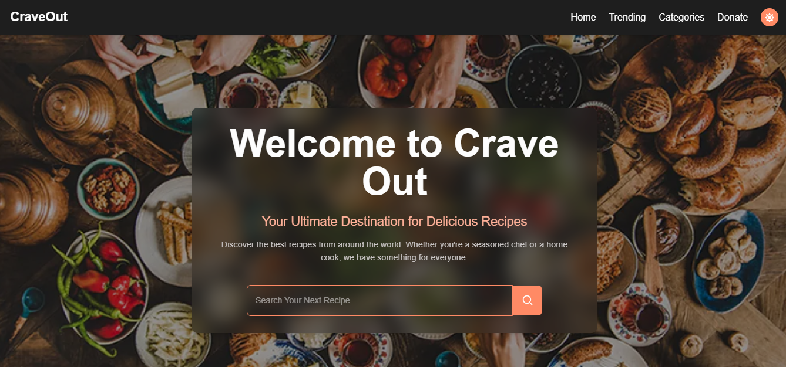
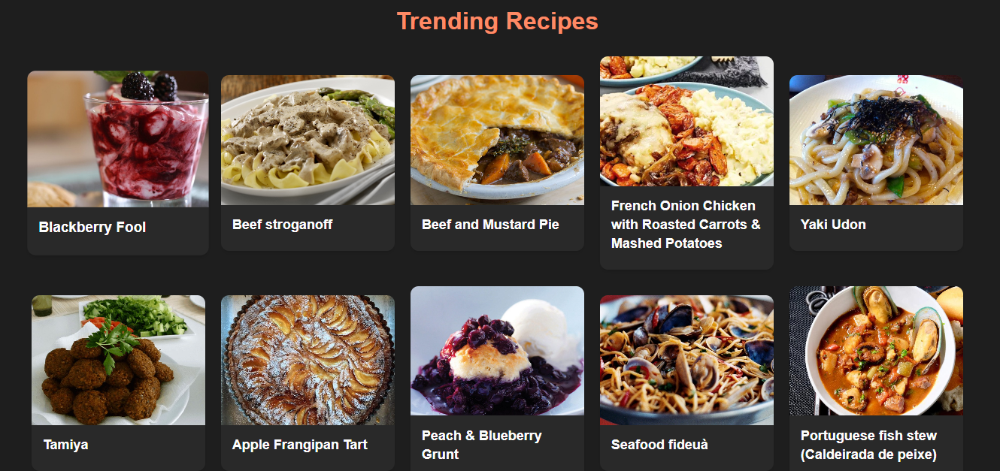
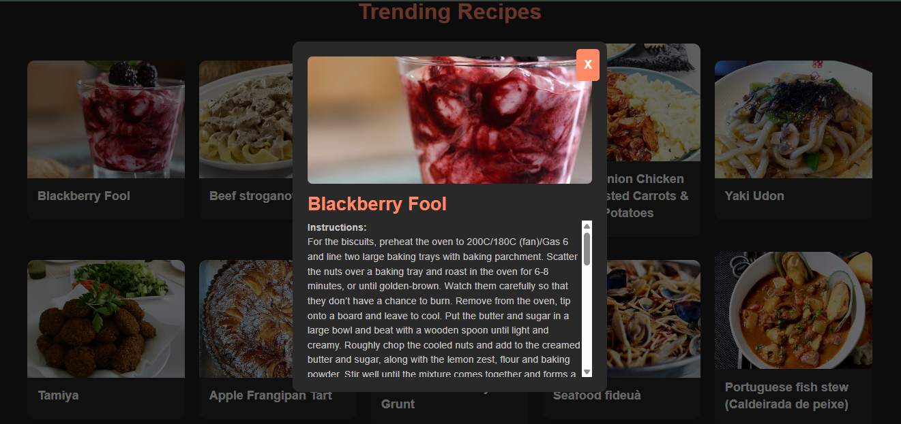

# CraveOut 🍽️ – AI Powered Recipe Explorer


**CraveOut** is a dynamic recipe explorer built using React, TypeScript, and Vite. It fetches delicious meals from the [TheMealDB API](https://www.themealdb.com/) and provides features like category browsing, trending meals, search functionality, theme toggling, AI generated recipes, and more – all with a responsive UI and modern design.

---

## 🔥 Features

### 🍴 Recipe Discovery

* Hero section with dynamic recipe search
* Trending recipes powered by random meal generation (single render on initial load)
* Category-based recipe browsing
* Quick recipe preview overlay
* Unified `RecipeCard` component across trending and category sections
* Skeleton loading states for trending, categories, and hero search results

### 🤖 AI Cooking Assistant

* AI Chat page powered by Gemini
* AI Recipes page to view saved AI plans
* Generate recipe ideas based on available ingredients  
* Get quick cooking tips and substitutions  
* Discover high-protein, budget, or quick meals  
* Receive markdown-formatted responses for better readability 
* Optional favorites-context toggle (uses saved favorites from LocalStorage)

### ⭐ Personalization

* Favorites page with LocalStorage persistence
* Easily save and remove favorite recipes

### 🎨 UI / UX

* Responsive design with TailwindCSS
* Light / Dark theme toggle
* Smooth scrolling navigation
* Modern card-based UI
* Route-based navigation for Home, Favorites, AI Chat, and AI Recipes
* Custom browser tab icon (`icon.png`)
* AI Chat and AI Recipes pages hide footer for distraction-free experience

---

## 🚀 Getting Started

### 1. Clone the repo

```bash
git clone https://github.com/NuhaG/CraveOut-v2.git
cd CraveOut-v2
```

### 2. Install dependencies

```bash
npm install
```

### 3. Configure environment variables

Create a `.env` file in `backend/`:

```
GEMINI_API_KEY=your_gemini_api_key_here
FRONTEND_ORIGIN=http://localhost:5173
PORT=5000
```

To generate an API key, visit [here](https://ai.google.dev/gemini-api/docs/api-key)

For the frontend, set your backend base URL (required for separate deployments like Vercel + Railway):

```
VITE_API_BASE_URL=https://your-backend.up.railway.app
```

If you proxy the backend under the same origin (for example, Vercel rewrites from `/api/*` to your backend), you can omit `VITE_API_BASE_URL`.

### 4. Run the development server

```bash
npm run dev
```

In another terminal, run backend:

```bash
cd backend
npm run dev
```

If you see `429 Too Many Requests` or quota errors on AI Chat, check your Gemini API project usage and free-tier limits:
https://ai.google.dev/gemini-api/docs/rate-limits

### 5. Build for production

```bash
npm run build
```

### 6. Preview production build

```bash
npm run preview
```

---

## 🛠 Tech Stack

### Frontend:

* React
* TypeScript
* Vite
* TailwindCSS
* React Router DOM

### APIs:

* TheMealDB API
* Google Gemini API

### Libraries:

* react-markdown
* remark-gfm

---

## Project Structure

```
CraveOut-v2
│
├── backend
│   ├── controllers
│   │   └── aiController.js
│   │
│   ├── middleware
│   │   └── rateLimiter.js
│   │
│   ├── routes
│   │   └── aiRoutes.js
│   │
│   ├── services
│   │   └── geminiService.js
│   │
│   ├── package.json
│   ├── package-lock.json
│   ├── .env
│   └── server.js
│
├── public
│   ├── food.png
│   ├── home.png
│   ├── hungry.webp
│   └── icon.png
│
├── src
│   ├── components
│   │   ├── About.tsx
│   │   ├── AiChatPage.tsx
│   │   ├── AiRecipesPage.tsx
│   │   ├── Categories.tsx
│   │   ├── Donate.tsx
│   │   ├── FavoritesPage.tsx
│   │   ├── Footer.tsx
│   │   ├── Hero.tsx
│   │   ├── Instructions.tsx
│   │   ├── Navbar.tsx
│   │   ├── RecipeCard.tsx
│   │   ├── RecipeSkeleton.tsx
│   │   └── TrendingRecipes.tsx
│   │
│   ├── lib
│   │   ├── favorites.ts
│   │   ├── aiPlans.ts
│   │   └── gemini.ts
│   │
│   ├── App.tsx
│   ├── main.tsx
│   ├── index.css
│   └── vite-env.d.ts
│
├── .gitignore
├── eslint.config.js
├── index.html
├── package.json
├── package-lock.json
├── README.md
├── tsconfig.json
└── vite.config.ts
```

---

## 🧱 Static Version

CraveOut was originally built using HTML, CSS, and vanilla JavaScript. You can explore the [static version here](https://github.com/NuhaG/Crave_out).
This React version brings modularity, speed, and a richer developer experience using a modern frontend stack.

---

## 📸 UI Preview - Dark Mode

> All screenshots below showcase **Dark Mode**. Light mode is also supported in the app.

### Hero Section with Search Bar


### Trending Recipes


### Recipe Card Overlay


---

## 🔮 Future Improvements

* Per-user chat history persistence
* User authentication
* AI-powered nutrition analysis
* User recipe upload section

## 📄 License

This project is licensed under the MIT License.
